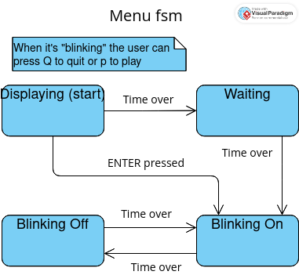
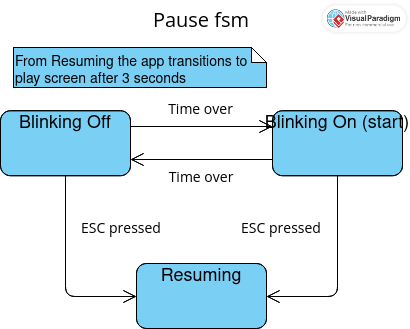

# Space Invaders Clone

This game, as the name suggests, is yet another
[SpaceInvaders](https://en.wikipedia.org/wiki/Space_Invaders)' clone.
Obviously It's not 100% the same as the original one.
But I guarantee it's good enough to be called Space Invaders Clone.

# Build instructions
## Linux

**NOTE 1**: For newbies, you must remember the command prompt from Windows, right?
Probably you even did some stuff in there. So, bring that experience to mind
everytime you read *terminal* here.

To start, open up a *terminal* window and try out each of these commands to see
which one prompts something other than "command not found" or so:\
**NOTE 2**: Don't copy the $. It's just a symbol people use to mean "that's a
*terminal* window", if you didn't know.

1. `$ sudo apt install make gcc git libsdl2-dev libsdl2-image-dev libsdl2-ttf-dev libsdl2-mixer-dev`
2. `$ sudo pacman -S make gcc git sdl2 sdl2_image sdl2_ttf sdl2_mixer`
3. `$ sudo dnf install make gcc git-all SDL2-devel SDL2_image-devel SDL2_ttf-devel SDL2_mixer-devel`

When the command runs, whichever it is, it's going to ask for your password.
So you just type it and press enter.\
**NOTE 3**: Don't worry if it seems like your keyboard stopped working because
nothing gets printed out. It's working.

Then, follow these commands:
```
$ git clone https://github.com/pgvalle/SpaceInvadersClone
(some stuff showing up here)
$ cd SpaceInvadersClone
$ make
(some stuff showing up here)
$ ./space_invaders.out
```
And you're done. You should have the game executing now. YAY!

## Windows

To be documented...

# Concepts
## Table of Contents

1. [Finite State Machines (at least two)](#finite-state-machines)
2. [Event Loop](#event-loop)
3. Animations
4. Keyboard and/or Mouse events
5. Timers
6. Collisions
7. Text and Images
8. [Dynamic collections (at least one)](#dynamic-collections)
9. [Something else...](#something-else)

## Finite State Machines

There's a total of 8 state machines that you can find in the code. Here's the diagram for each one of them:

### Screens (main.c:39)

### Menu (main.c:168)

### Play (main.c:207)

### Pause (main.c:195)

### Game Over (main.c:181)


## Event Loop

Here's how I have my event loop (look at main.c:1513 for more details):
```
void main_loop()
{
    uint32_t before = 0, event_wait_time = 1000 / FPS;

    while (app.screen != APP_QUIT)
    {
        // beginning of loop. Get current time.
        const uint32_t start = SDL_GetTicks();

        // wait for event
        if (SDL_WaitEventTimeout(&app.event, event_wait_time))
        {
            // switch statement for screen event handling ...

            // calculate remaining time to wait next loop.
            const uint32_t event_processing_time = SDL_GetTicks() - start;
            // careful not to be value lower than zero. it's an unsigned int.
            event_wait_time -= event_processing_time < event_wait_time ?
                event_processing_time : 0;
        }
        else
        {
            app.frame_time = SDL_GetTicks() - before;
            before += app.frame_time;

            // switch statement for screen updating and rendering ...

            event_wait_time = 1000 / FPS; // reset event wait time
        }
    }
}
```

## Dynamic collections

First of all, a quick shout to [nothings](https://github.com/nothings).
I used their dynamic structures library [stb_ds.h](https://github.com/nothings/stb/blob/master/stb_ds.h). Really good piece of software, btw! Saved me so much hours I can't even count.
There are three dynamic collections in the game: explosions (main.c:215), invaders (main.c:247) and shots (main.c:233 and main.c:252).

## Something Else...

I was supposed to implement an algorithm, data structure or effect in my game that would make it more than just an example application implemented using all the concepts required.
I came up with a technique to render texts (main.c:58).\
I basically picked an almost monospaced font, rendered ascii characters in a specific order as an image once, and used that specific order to quickly map a character, say 'A', to a section of the image which contains 'A'. It helped me rendering dynamic ui elements like the score counter.