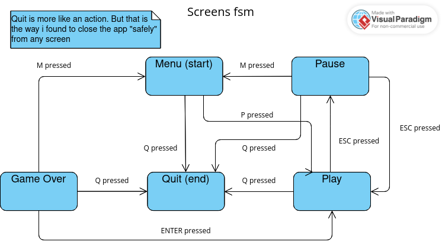
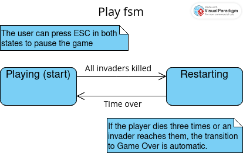
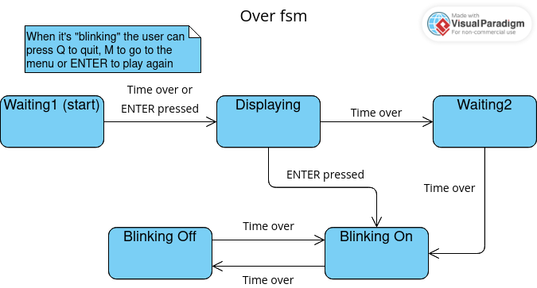

# Space Invaders Clone

This game, as the name suggests, is yet another
[SpaceInvaders](https://en.wikipedia.org/wiki/Space_Invaders)' clone.
Obviously It's not 100% the same as the original one.
But I guarantee it's good enough to be called Space Invaders Clone.

# Build instructions
## Linux

To start, you must install sdl2 and sdl2-image. If you don't know what the packages names are,
here are the commands to install those in debian, arch and fedora based distros with some extra
stuff you need but might not have installed:

1. `$ sudo apt install make gcc git libsdl2-dev libsdl2-image-dev libsdl2-ttf-dev libsdl2-mixer-dev`
2. `$ sudo pacman -S make gcc git sdl2 sdl2_image sdl2_ttf sdl2_mixer`
3. `$ sudo dnf install make gcc git-all SDL2-devel SDL2_image-devel SDL2_ttf-devel SDL2_mixer-devel`

Using make should produce an executable called space_invaders.out inside the repo root folder
And you're done. You should be able to execute the game now.

## Windows

To be documented...

# Concepts
## Table of Contents

1. [Finite State Machines (at least two)](#finite-state-machines)
2. [Event Loop](#event-loop)
3. Animations
4. Keyboard and/or Mouse events
5. Timers
6. Collisions
7. Text and Images
8. [Dynamic collections (at least one)](#dynamic-collections)
9. [Something else...](#something-else)

## Finite State Machines

There's a total of 8 state machines that you can find in the code. Here's the diagram for each one of them:

### Screens (main.c:39)

### Menu (main.c:168)

### Play (main.c:207)

### Pause (main.c:195)

### Game Over (main.c:181)


## Event Loop

Here's how I have my event loop (look at main.c:1513 for more details):
```
void main_loop()
{
    uint32_t frame_start = 0, event_start = 0, event_wait_time = 1000 / FPS;

    while (app.screen != APP_QUIT)
    {
        // wait for event
        if (SDL_WaitEventTimeout(&app.event, event_wait_time))
        {
            // switch statement for screen event handling ...

            // calculate remaining time to wait next loop.
            const uint32_t processing_time = SDL_GetTicks() - start;
            event_start += processing_time;
            // careful not to be value lower than zero. it's an unsigned int.
            event_wait_time = processing_time < event_wait_time ?
                (event_wait_time - processing_time) : 0;
        }
        else
        {
            // switch statement for screen updating and rendering ...
            
            app.frame_time = SDL_GetTicks() - frame_start;
            frame_start += app.frame_time;
            
            event_start = frame_start;
            event_wait_time = 1000 / FPS; // reset event wait time
        }
    }
}
```

## Dynamic collections

First of all, a quick shout to [nothings](https://github.com/nothings).
I used their dynamic structures library [stb_ds.h](https://github.com/nothings/stb/blob/master/stb_ds.h). Really good piece of software, btw! Saved me so much hours I can't even count.
There are three dynamic collections in the game: explosions (main.c:215), invaders (main.c:247) and shots (main.c:233 and main.c:252).

## Something Else...

I was supposed to implement an algorithm, data structure or effect in my game that would make it more than just an example application implemented using all the concepts required.
I came up with a technique to render texts (main.c:58).\
I basically picked an almost monospaced font, rendered ascii characters in a specific order as an image once, and used that specific order to quickly map a character, say 'A', to a section of the image which contains 'A'. It helped me rendering dynamic ui elements like the score counter.
